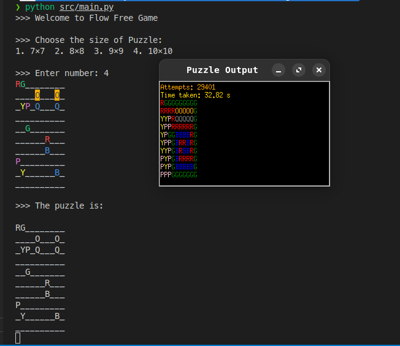

# Flow Free Game Documentation
## Overview

This Python script implements a simple console-based version of the Flow Free puzzle game. The game allows users to choose a puzzle size, read an initial puzzle configuration from a file, and solve the puzzle using a constraint satisfaction problem (CSP) approach.

## Features

- Choose from different puzzle sizes (7x7, 8x8, 9x9, 10x10).
- Load puzzle configurations from input files.
- Solve the puzzle using backtracking algorithm.
- Save the solution and number of attempts to an output file.
- Measure execution time of the solving process.

## File Structure
```bash
/flow-free-game
│
├── input/
│   ├── input77.txt
│   ├── input88.txt
│   ├── input99.txt
│   └── input1010.txt
│
├── output/
│   ├── output77.txt
│   ├── output88.txt
│   ├── output99.txt
│   └── output1010.txt
│
├── src/
│   ├── Csp.py
│   ├── Grid.py
│   └── main.py
```
## output



## Requirements

- Python 3.11
- Custom modules:
  - `Grid`: Handles grid representation and operations.
  - `Csp`: Implements the backtracking algorithm for solving the puzzle.


## Installation

1. Clone the repository:
   ```bash
   git clone <repository-url>
   cd flow-free-game
   ```
2. Ensure that the required modules (Grid and Csp) are in the project directory.
3. Prepare input files in the input folder with names following the format input77.txt, input88.txt, input99.txt, input1010.txt.

## Usage
1. Run the program:
   ```bash
    python src/main.py
    ```
2. Follow the on-screen prompts to select the puzzle size.
3. The output will be written to a file in the output folder with the corresponding size name (e.g., output77.txt).